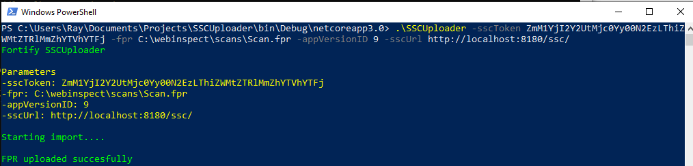

# SSC Uploader
A tool for uploading FPR's to SSC.

# Why
SCA comes with an FPR utility. However, WebInspect users also want to upload their FPR's to their SSC instance.

# Features
- Upload SCA and WebInspect FPR files to SSC
- Cross plaform - It will run on Windows, Linux, Mac and Docker Windows/Linux containers.
- Customizable - Download the source code and customize it for your own CI/CD process.  
- The entire SSC API is implemented for custom actions or behaviors. 

# Usage
Simply execute the SSCUploader from the command line with the appropriate parameters:
- fpr: Fully qualified path to the FPR file
- sscToken: SSC authorization token
- appVersionID: SSC application Id
- sscUrl: SSC url. Example: http://myhost/ssc

Example: SSCUploader.exe -authToken MYAUTHTOKEN -fpr C:\webinspect\scans\Scan.fpr -applicationVersionID 9 -sscUrl http://myhost:8180/ssc/

